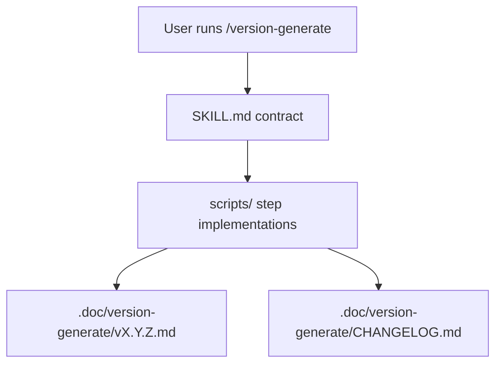

> [!NOTE]
> This README was generated by [SKILL](https://github.com/agenvoy/skill-readme-generate), get the ZH version from [here](./doc/README.zh.md). 
> This skill's implementation was fully agent-generated; the developer only tuned its input/output.

***

<strong>STRUCTURED CHANGELOGS WITH SEMVER AUTOMATION AND TRACEABILITY!</strong>

***

> A Claude Code skill generating structured bilingual changelogs with SemVer automation, conventional commits parsing, and release traceability

## Table of Contents

- [Features](#features)
- [Architecture](#architecture)
- [License](#license)

## Features

> `git clone https://github.com/pardnchiu/skill-version-generate ~/.claude/skills/version-generate` · [Documentation](./doc/doc.md)

- **Automatic SemVer Bump** — Determines the next version by tag priority: BREAKING > FEAT > PATCH.
- **Conventional Commits First** — Parses `feat:` / `fix:` prefixes first; falls back to diff semantics when absent.
- **Traceable Changelog** — Every entry carries PR number, author handle, commit hash, and GitHub compare link.
- **Enforced Breaking Migration** — Breaking changes must include migration guidance, or generation aborts without a partial file.
- **Auto-Maintained Master Index** — Syncs `.doc/version-generate/CHANGELOG.md` by prepending the new release with summary counts.

## Architecture

> [Full Architecture](./doc/architecture.md)

## License

This project is licensed under the [MIT LICENSE](LICENSE).
